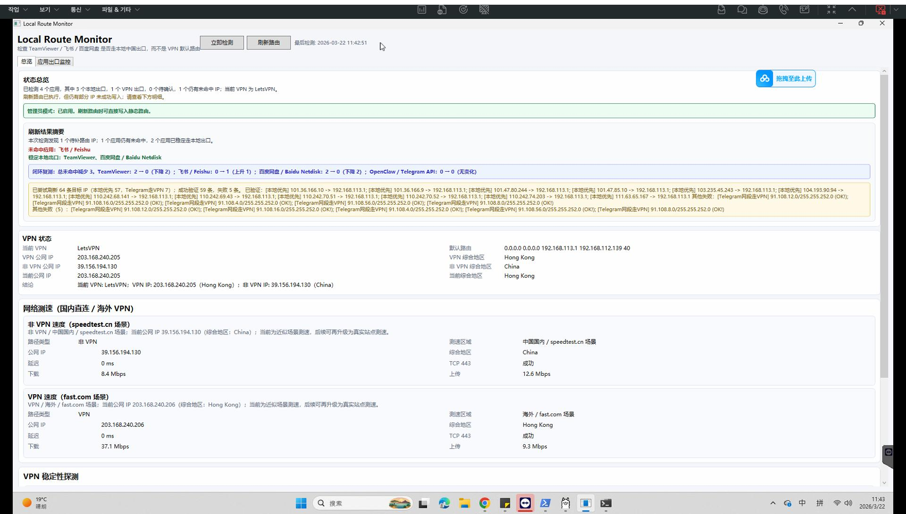
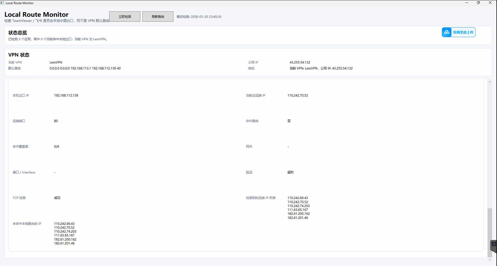

# Local Route Monitor

Local Route Monitor 是一个 Windows 桌面工具，用来诊断“哪些应用走本地出口、哪些应用走 VPN 出口”，并帮助把关键流量稳定固定到预期路由。

当前已重点覆盖：
- TeamViewer
- 飞书 / Feishu
- 百度网盘 / Baidu Netdisk
- OpenClaw / Telegram API

## Screenshots

### 总览


### 应用出口监控 / 路由诊断


## 当前能力

### 1. 应用出口监控
- 识别应用当前主连接的本机源地址、远端 IP、路由命中情况
- 判断当前更像是 **本地出口**、**VPN出口**、**待确认** 或 **未连接**
- 展示未命中 IP、修复指向、TCP 可达性、延迟等信息

### 2. 路由刷新（双策略）
- **本地优先目标**：TeamViewer / 飞书 / 百度网盘 继续固定到本地网关
- **VPN 优先目标**：OpenClaw / Telegram API 固定到 VPN 网关
- 已增强 Telegram 相关覆盖：不仅处理实时观测到的单个 IP，也补充常见 Telegram 网段的 VPN 路由覆盖，降低重连后换 IP 导致的不稳定

### 3. VPN 状态与地区识别
- 展示 VPN / 非 VPN 的公网 IP
- 使用多源结果做 **综合地区** 判断
- 当前会优先把常见香港 VPN 节点更合理地识别为 `Hong Kong`

### 4. 网络测速（场景化）
- **非 VPN 速度（speedtest.cn 场景）**
- **VPN 速度（fast.com 场景）**
- 当前为“近似场景测速”，用于快速诊断链路质量；后续如有需要，可继续升级为真实网页测速

### 5. VPN 稳定性探测
内置对以下目标的 TCP 443 可达性与延迟采样：
- Telegram API
- Cloudflare Speed
- Google
- GitHub

## UI 结构
当前界面已拆为两个 tab：
- **总览**：状态总览、刷新结果摘要、VPN 状态、测速、稳定性探测
- **应用出口监控**：单独查看所有应用出口卡片

## Release Notes
- 见：[`docs/RELEASE_NOTES.md`](docs/RELEASE_NOTES.md)

## 运行方式

### 直接运行（开发）
```bat
run.bat
```

### 或手动运行
```powershell
cd src/LocalRouteMonitor
dotnet run
```

### 构建
```powershell
cd src/LocalRouteMonitor
dotnet build
```

## 目录结构
```text
src/LocalRouteMonitor/
  App.xaml
  MainWindow.xaml
  MainWindow.xaml.cs
  RouteInspector.cs
  RouteRefresher.cs
  NetworkInspector.cs
  RouteDiagnosticsCache.cs
  ...
docs/
  RELEASE_NOTES.md
  screenshots/
run.bat
README.md
```

## 注意事项
- “刷新路由”会修改系统静态路由，建议以管理员权限运行
- 结果依赖当前网络状态、VPN 节点质量、以及目标服务实际连接 IP
- “综合地区”来自多源 IP 地理结果的综合判断，并不等于绝对真实物理位置

## 后续可继续增强
- 真实 `fast.com` / `speedtest.cn` 浏览器测速
- Telegram 连接历史 / IP 切换历史展示
- 应用卡片按“本地优先 / VPN优先”分组
- 托盘运行、历史趋势、日志页
